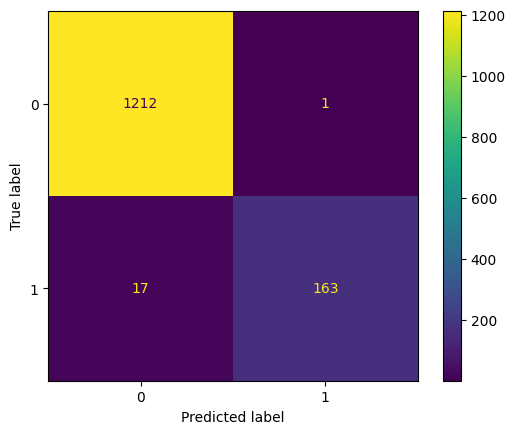

# spam-detector

Benchmarking Machine Learning Models on Email Spam Detection

## Results

The best model was Multilayer Perceptron (MLP).

```
              precision    recall  f1-score   support

           0       0.99      1.00      0.99      1213
           1       0.99      0.91      0.95       180

    accuracy                           0.99      1393
   macro avg       0.99      0.95      0.97      1393
weighted avg       0.99      0.99      0.99      1393
```

### Confusion Matrix

The confusion matrix for the MLP results:



## License

[MIT License](LICENSE)